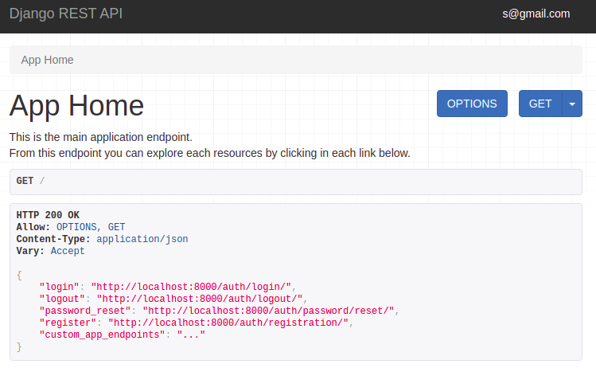
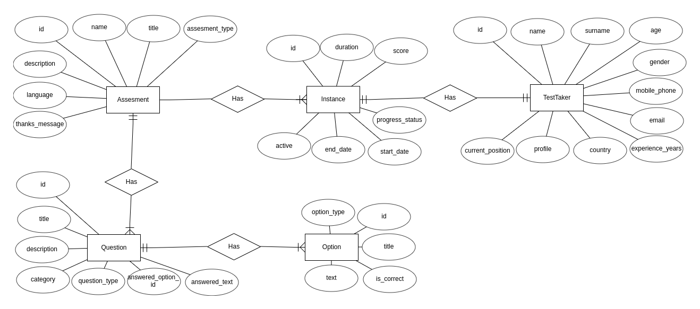

DRF API
=======

This project is a base API developed using [Django REST Framework](https://www.django-rest-framework.org/) that contains user registration, login and logout features, as well as account verification and password reset flow via email.

The whole application runs over Docker ecosystem and has a built-in functionality called `"Browsable API"`, which allows you to explore the entire API from a web browser. In this image you can see the main view of the service API.



This codebase lets you add any custom django application with lot of functionality built-in. In [Applications](#applications) section you can find usage info for each custom installed app.

## Getting started 🚀

This section is a guide with the essential steps so that you can start the application.

<details><summary><b>See the necessary steps</b></summary>

### Install dependencies

To run this project you need to install `Docker` and` Docker Compose`.

In [this article](https://support.netfoundry.io/hc/en-us/articles/360057865692-Installing-Docker-and-docker-compose-for-Ubuntu-20-04) are the details to install Docker and Docker Compose on a Linux machine. In case you want to install the tools on another platform or have any problems, you can read the official documentation of [Docker](https://docs.docker.com/get-docker/) and also that of [Docker Compose](https://docs.docker.com/compose/install/).

Continue with downloading the code when you have the dependencies installed and working.

### Download the code

To download the code, the best thing to do is to `fork` this project to your personal account by clicking on [this link](https://github.com/agustinBassi/django-rest-api/fork). Once you have the fork to your account, download it from the terminal with this command (remember to put your username in the link):

```
git clone https://github.com/USER/django-rest-api.git
```

> In case you don't have a Github account, or you don't want to fork, you can directly clone this repo with the command `git clone https://github.com/agustinBassi/django-rest-api.git`.

### Initial project configuration

To run the application, you first need to download the database image with the `docker-compose pull db` command. Next, you need to compile the REST API service with the `docker-compose build django-rest-api` command (it may take a few minutes).

When the above processes finish, start the database service with the command `docker-compose up -d db` from the root of the project. With the database running, it is necessary to create the tables that the application needs to work with the command `docker-compose run django-rest-api python manage.py migrate`.

It is possible to include sample data to test the API as quickly as possible. The sample data is in the `.fixtures` directory. The command needed for load fixture is as follows (in the example, the `assesments.json` fixtures will be loaded):

```
docker-compose run django-rest-api python manage.py loaddata .fixtures/assesments.json
```

### Run the application

With the initial configurations done, it is time to run the API service with the command `docker-compose up django-rest-api` (if you want to run the service in background, you can add the -d flag during execution). When the service starts, you can access the `Browsable API` from the browser by entering the [api root endpoint](http://localhost:8000/) in the browser.

If you are able to access the `Browsable API`, it means that the application is running correctly.

</details>

Keep exploring the project once you have it up and running.

## Main information 🔍

In this section you will find the information to understand and configure the project.

<details><summary><b>See the details</b></summary>

### Main features

Below you can see the main features of the project:

* RESTful API fully explorable through the "Browsable API" and hyperlinks
* User registration, login, logout, password recovery, account activation
* User email as a unique source of truth
* Application administration panel
* Customized Browsable API for each endpoint
* Extensive usage documentation
* Configurable pagination

The feature related to each application is included in the [Applications](#applications) section.

### Django Configuration

In the file `djangorestapi/settings.py` you will find the general configuration of the Django project. Within this file, all kinds of Django configurations can be made, in which the following stand out:

* Selection and configuration of the database engine.
* Applications installed within the project.
* Time zone setting.
* Project debug configuration.
* Django REST Framework specific configuration.
* Template configuration.
* Directory configuration for static files.
* User model selection.
* User Authentication & Authorization.

For more information on all the possible configurations, you can access the official documentation at [this link](https://docs.djangoproject.com/en/3.2/topics/settings/).

### Browsable API

This application - by using Django REST Framework - has a functionality that makes the REST API browsable in HTML format. This feature is really an excellent functionality, as it enables you to explore, navigate, and discover the API without having to open any dedicated programs (such as Postman or other clients).

From the browsable API you can access to Home Endpoint, and navigate over the user registration, login, logout, password recovery and email confirmation flows. 

The usage flow related of each application is included in its [Applications](#applications) section.

### How to use the service API

The starting point of using the API is accessing its [root](http://localhost:8000) via a client or a browser. From there you can see some useful endpoints related to user registration, login, logout and probably your custom applications endpoints.

**User Registration, Verification & Login**

1. Access to the [root endpoint](http://localhost:8000) to explore the service endpoints.
2. Access to the [user registration](http://localhost:8000/auth/registration) endpoint to create an user account. Fill fields with your email and insert twice an strong password.
3. Verify your account via email accessing to the link shown in the console after registration.
4. Access to the email verification and insert your email and password. An access tokens will be returned. You can save it for your mobile/web/desktop app. If you are using the Browsable API the user will be logged in.
5. Go to [root endpoint](http://localhost:8000) and explore applications endpoints.

**User Logout**

To logout just follow the [user logout](http://localhost:8000/auth/logout) endpoint and send a POST request.

**User Password Reset**

If you have forgotten your password, you can recover it accessing to the [password change endpoint](http://localhost:8000/auth/password/change/). Follow the next steps:

1. Insert your email and send it via POST.
2. Check your email or the "django console email" to access to the link to password change.
3. Insert the needed fields. `UID` is the anteultimate URL slug, and the `Token` field is the last URL slug (probaby the token slug includes a "-" char). After required fields just type your new password twice and POST it.

**Applications flows**

The specific app endpoints are described in each section of [Applications](#applications).

### Using the admin site

The API service has an integrated administration panel that allows you to perform CRUD operations on each of registered applications models (tables). In this image you can see how the administration panel looks.


To use the admin site you must create a superuser before. Execute the command `docker-compose run django-rest-api python manage.py createsuperuser`, enter your email and your password twice and then go to [admin endpoint](http://localhost:8000/admin) to login with your credentials.

There are many sections included in the admin, like `Accounts`, `Tokens`, `Sites`, `Social Accounts` and `Users`. This applications are included in the base project to provide user auth flows.

Apart of the base sections, there are the custom applications, explained in the [Applications](#applications) section.

### Environment Variables

Some environment variables used by the database service, as well as the API service, are defined in the `env` file. Necessary variables can be added/removed. In case you accidentally delete the values or the env file, below you can find some values that work correctly with the application.

```
DJANGO_SECRET_KEY=sup3rs3cr3tk3y
DJANGO_DEBUG=True
DATABASE_NAME=codedb
DATABASE_USER=postgres
DATABASE_PASS=postgres
DATABASE_HOST=db
DATABASE_PORT=5432
LOGLEVEL=info
ACCESS_TOKEN_LIFETIME=120
```

It is **HIGHLY RECOMMENDED**that you change these variables if you want to use this application for productive purposes.

### Database manipulation

Django provides an excellent database manipulation without the need to use any external tools to perform the necessary operations.

If you want to make a simple backup of the database, execute the following command:

```
docker-compose run django-rest-api \
python manage.py dumpdata --indent 2 > .fixtures/db.json
```

If you want to make a backup of the database that can be used in a fresh database, execute the following command:

```
docker-compose run django-rest-api \
python manage.py dumpdata --indent 2 \
--exclude auth.permission --exclude contenttypes --exclude admin.logentry > .fixtures/db.json
```

To load the application data into a fresh database, run the following command to create the necessary tables:

```
docker-compose run django-rest-api python manage.py migrate
```

And then load data inside the tables:

```
docker-compose run django-rest-api python manage.py loaddata .fixtures/db.json
```

### Dirs structure

The base structure is as follows:

```sh
├── .fixtures                       # dir to save DB fixtures to export/import using Django manage.py
├── users                           # main users app dir
│   ├── migrations                  # dir to track DB modifications
│   ├── admin.py                    # register user model into admin interface
│   ├── apps.py                     # register user app into Django
│   ├── managers.py                 # classes for serialize/deserialize models instances
│   ├── models.py                   # user models declaration
│   ├── serializers.py              # classes for serialize/deserialize models instances
├── djangorestapi                         # main Django project
│   ├── asgi.py                     # utility to load Django app into ASGI servers
│   ├── settings.py                 # main Django project settings
│   ├── urls.py                     # main Django project URLs configuration
│   |── wsgi.py                     # utility to load Django app into WSGI servers
│   └── views.py                    # main service endpoints (home)
├── doc                             # dir to save documentation
│   └── ...
├── .gitignore                      # exclude files from versions control
├── .dockerignore                   # exclude files when build a docker image
├── CHANGELOG.md                    # project changes history and descriptions
├── Contribuitors.md                # project contribuitors
├── Dockerfile                      # Dockerfile for Django project
├── LICENSE                         # licencia del proyecto
├── README.md                       # este archivo
├── docker-compose.yml              # configuración de los contenedores de Docker centralizada
├── env                             # variables de entorno utilizadas en el proyecto
├── manage.py                       # archivo con utilidades nativas de Django
└── requirements.txt                # dependencias de Python del proyecto
```

Custom applications structure are not included.

</details>

## Applications 📚

In this section you will find information that will help you to have a greater context about each custom applications.

<details><summary><b>Read the apps info</b></summary>

### Assesments API

The Assesments API has needed functionality to permorm assesments and create its questions, options, and their relations.

<details><summary><b>See all info related to Assesments APP</b></summary>

#### Assesments Features

* Assesments assisted navigation for all flows
* Assesments instances recovery
* Assesments error preventions
* Timed assesments instances
* Automatic score calculation

#### Assesments sample data

The application comes with sample data at `.fixtures/assesments.json`. To load this data you have to execute the command `docker-compose run django-rest-api python manage.py migrate` and then, execute the command `docker-compose run django-rest-api python manage.py loaddata .fixtures/assesments.json` as explained in the [Getting Started](#getting-started) section.

#### Using the Assesments admin site

At first, it is necessary to create a superuser as described in the [Using the admin site](#using-the-admin-site) and then, login at the [admin endpoint](http://localhost:8000/admin). 

Inside the admin panel you can create different assesments, assign questions and options. From the left panel you can create all the entities that you consider necessary and the relationships between them.

#### How to use the Assesments API

The starting point to use the application's API is to create a user and validate it as explained in the [How to use the service API](#How-to-use-the-service-API). Optionally you can load sample data as described above or load your data manually from the admin site.

Once logged in and having some data to play, access to the URL [Assesments Home](http://localhost:8000/v1/assesments) to see different options. 

To perform an `Assessment`, start by creating an` Instance` accessing the URL of a particular assessment, for example [http://localhost:8000/v1/assesments/assesments/1/create](http://localhost:8000/v1/assesments/assesments/1/create) with a POST. 

Once the assesment is created, just follow the `next` link provided in the response body, which assist you in the whole assesment flow navigation until you finalize it.

The response from the endpoint returns the id and URL of the created instance. With that id you can access the following endpoints:

* `instances/<uuid:pk> /`: to get the instance details.
* `instances/<uuid:pk>/test`: to check that the instance is available for testing.
* `instances/<uuid:pk>/start`: to start an instance, set the start_time, the end_time and the active flag.
* `instances/<uuid:pk>/questions/<int:q_id>`: in the endpoint to get the details of the instance, in the `assesment-> question_count` field you can get the number of questions of the assesment. Then, you can access each of them, from 1 to question_count. Any value outside of these values ​​will return a 405 Not Allowed code.
* `instances/<uuid:pk>/answer`: to send the answer about an assessment. Get a question_id and option_id in the request body.
* `instances/<uuid:pk>/end`, to end an instance, set the end_time, set the active flag to False and calculate the score automatically.
* `instances/<uuid:pk>/result`: to get the result of a particular instance.
* `instances/restore`: to recover an instance (if there is one active) of a particular taker.

#### ERD (Entity-Relation Desing)

In the next figure you can see the `Assesments App` entities design and their relationships using the online tool [EDR Plus](https://erdplus.com/standalone).



An `Assesment` is defined only once, and in addition to its attributes, it has one or more` Questions` associated with it. In turn, each `Questions` has one or more` Options` associated with it.

In order to carry out an `Assesment` it is necessary for a` Taker` to register with its data, and to create an `Instance` of an` Assesment`. Each `Instance` has, in addition to its attributes, a UUID as an identifier. This allows the instance to be retrieved from another browser based on the Taker data.

#### Endpoints

Each endpoint is listed below, with its description and available methods.

* `assesments/` - Shows a list with all the available resources of the application (GET)
* `assesments/assesments` - Show a list of all available assesments (GET)
* `assesments/assesments/<id>` - Show the HOME of a specific test (GET)
* `assesments/assesments/<id>/status` - Check the status of an assessment and return its status (GET)
* `assesments/assesments/<id>/create` - Creates a new instance of an assesment and returns the UUID of the instance (POST)
* `assesments/instances` - List all available instances (GET) (*)
* `assesments/instances/<id>` - Show the details of the instance (GET)
* `assesments/instances/<id>/test` - Check that the instance is active (GET)
* `assesments/instances/<id>/start` - Starts the test and starts the countdown (POST)
* `assesments/instances/<id>/questions/<id>` - Show the detail with the question of an instance (GET)
* `assesments/instances/<id>/answer` - Send the result of an answer (PUT)
* `assesments/instances/<id>/end` - End an instance (POST)
* `assesments/instances/<id>/result` - Show the result of an instance (GET)
* `assesments/instances/restore` - Allows you to retrieve an instance based on user data (POST)
* `assesments/takers` - Show a list with all the test takers that performed assesments (GET) (*)
* `assesments/takers/<id>` - Show the detail of a specific taker (GET) (*)
* `assesments/takers/me` - Show the detail of a logged in taker (GET & PUT)
* `assesments/questions` - List all available questions (GET) (*)
* `assesments/questions/<id>` - Show the detail of a specific question (GET) (*)
* `assesments/options` - List all available options (GET) (*)
* `assesments/options/<id>` - Show the detail of a specific option (GET) (*)

Although the information of each endpoint is in the previous list, it is much better to navigate through the `Browsable API` that allows access to more information about each of the endpoints.

> Endpoints with (*) can only be accessed using staff or super user acccount.

#### Correlation-One Requests/Responses

To better understand the functionality of the Correlation One API, you can perform an assessment flow by entering [this link](https://quiz.correlation-one.com/test/data-scientist). Likewise, by reviewing network traffic from the browser's development window, analyzing and understanding the information sent and received in each request, you will be able to have a better context about the necessary functionality.

To facilitate access to endpoint information, you can access the file `doc/assesments/c1-requests-responses.md`, where the requests/responses made against the Correlation One API are stored.

Much of the functionality is inspired by API messages, albeit with a few differences.

</details>

</details>

## TODOs 📝

In this section you can see the pending functionalities of the project and a possible way to implement them.

<details><summary><b>See the complete to-do list</b></summary><br>

* **Run the application with a productive web server**: For the development and demonstration of the application, the Django development web server is used. If you want to implement a productive server, in [this link](https://docs.djangoproject.com/en/3.2/howto/deployment/wsgi/uwsgi/), for example, there is information to configure uWSGI.
* **SSL encryption**: This project is for demonstration purposes, and also uses the development web server provided by Django. If you want to bring this project to a productive environment, SSL should be implemented in the webserver used. For example, in [this link](https://www.youtube.com/watch?v=NhidVhNHfeU) you will find information on how to configure certificates in Nginx. Also, in [this link](https://timonweb.com/django/https-django-development-server-ssl-certificate/) there is a tutorial on how to enable HTTPS using the Django development server.
* **Compress responses**: If a productive web server were used, compression of the responses could be performed. In [this link](https://rtcamp.com/tutorials/nginx/enable-gzip/) there is a tutorial to enable Gzip on an Nginx server.
* **Support other formats than text**: Although the challenge required that more than one format can be handled for questions and options, in this API they only have one format (CharField). Both plain text and HTML can be stored in this text field. If you wanted to save an image, it could be hosted in an S3 bucket and only save the URL in the field.
* **Automated testing**: Although having automated testing is a totally necessary feature, it was not implemented for this project. Implementing unit testing is not too complex. If you want to implement it, in [this link](https://docs.djangoproject.com/en/3.2/topics/testing/overview/) you will find all the necessary information.
* **TODO**: check that updates over user on admin site does not impact in the EmailAddress table. Capture update signal.
* **TODO**: add logging to whole application
* **TODO**: change home screenshot for one without assesments
* **TODO**: move permissions to dedicated folder instead of using it into each app

</details>

## Used technologies 🛠️

In this section you can see the most important technologies used.

<details><summary><b>See the complete list of technologies</b></summary><br>

* [Docker](https://www.docker.com/) - Ecosystem that allows the execution of software containers.
* [Docker Compose](https://docs.docker.com/compose/) - Tool that allows managing multiple Docker containers.
* [Python](https://www.python.org/) - Language in which the services are made.
* [Django](https://www.djangoproject.com/) - Popular Python framework for web application development.
* [Django REST Framework](https://www.django-rest-framework.org/) - Django-based framework for designing REST APIs.
* [PostgreSQL](https://www.postgresql.org/) - Database to query and store data.
* [Visual Studio Code](https://code.visualstudio.com/) - Popular multi-platform development IDE.

</details>

## Contribute 🖇️

If you are interested in the project and would like to join muscles so that it continues to grow and improve, you can open a discussion thread to discuss your proposals at [this link](https://github.com/agustinBassi/django-rest-api/issues/new). You can also read the file [Contribute.md](https://github.com/gotoiot/gotoiot-doc/wiki/Contribuir) where the steps are well explained so that you can send pull requests.

## Tokens of appreciation 🎁

If you liked this project and would like to support it, any of these actions would be more than fine for me:

* Support this project with a ⭐ on Github to reach more people.
* Share this project with other people.

## Authors 👥

The main collaborations were made by:

* **[Agustin Bassi](https://github.com/agustinBassi)**: Ideation, start-up and maintenance of the project.

You can also look at all the people who have participated in the [full list of contributors](https://github.com/agustinBassi/django-rest-api/contributors).

## License 📄

This project is under ([MIT](https://choosealicense.com/licenses/mit/)) License. You can see the file [LICENSE.md](LICENSE.md) for more details on the use of this material.
