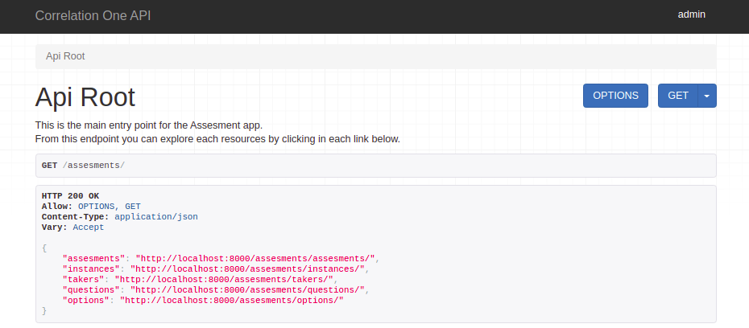
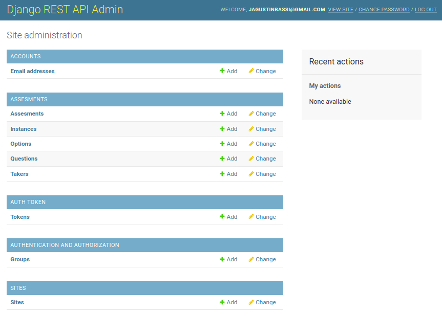

<a href="https://www.correlation-one.com/">
    
</a>

Code API
========

This project is an API to perform code challenges for Data Science jobs, inspired by the [Correlation One API](https://quiz.correlation-one.com/test/data-scientist).

The API is developed in Python with [Django REST Framework](https://www.django-rest-framework.org/) (DRF) that allows creating RESTful APIs in a consistent and scalable way. Likewise, it runs on a Docker container that allows the application to run in the same way in multiple environments. The database used to store the information of the assesments, takers, and questions, is PostgreSQL, also running on a Docker container.

The API has a built-in functionality called "Browsable API", which allows you to explore the entire API from a web browser, and in this image you can see the main view of the assessment API.



## Getting started 🚀

This section is a guide with the essential steps so that you can start the application.

<details><summary><b>See the necessary steps</b></summary>

### Install dependencies

To run this project you need to install `Docker` and` Docker Compose`.

In [this article](https://support.netfoundry.io/hc/en-us/articles/360057865692-Installing-Docker-and-docker-compose-for-Ubuntu-20-04) are the details to install Docker and Docker Compose on a Linux machine. In case you want to install the tools on another platform or have any problems, you can read the official documentation of [Docker](https://docs.docker.com/get-docker/) and also that of [Docker Compose](https://docs.docker.com/compose/install/).

Continue with downloading the code when you have the dependencies installed and working.

### Download the code

To download the code, the best thing to do is to `fork` this project to your personal account by clicking on [this link](https://github.com/agustinBassi/code-api/fork). Once you have the fork to your account, download it from the terminal with this command (remember to put your username in the link):

```
git clone https://github.com/USER/code-api.git
```

> In case you don't have a Github account, or you don't want to fork, you can directly clone this repo with the command `git clone https://github.com/agustinBassi/code-api.git`.

### Initial project configuration

To run the application, you first need to download the database image with the `docker-compose pull db` command. Next, you need to compile the REST API service with the `docker-compose build code-api` command (it may take a few minutes).

When the above processes finish, start the database service with the command `docker-compose up -d db` from the root of the project. With the database running, it is necessary to create the tables that the application needs to work with the command `docker-compose run code-api python manage.py migrate`.

In this project some sample data is included so that you can put the application to work with preloaded information. It is recommended that you import this data to test the application quickly without having to load the test data manually. To load the pre-loaded data, run the following command:

```
docker-compose run code-api python manage.py loaddata .fixtures/db.json
```

### Run the application

With the initial configurations done, it is time to run the API service with the command `docker-compose up -d code-api` (if you want to run the service interactively, you can remove the -d flag during execution). When the service starts, you can access the `Browsable API` from the browser by entering the URL [http://localhost:8000/v1/assesments](http://localhost:8000/v1/assesments) in the browser.

If you were able to access the `Browsable API` it means that the application is running correctly.

</details>

Keep exploring the project once you have it up and running.

## Main information 🔍

In this section you will find the information to understand and configure the project.

<details><summary><b>See the details</b></summary>

### Main features

Below you can see the main characteristics of the project:

* RESTful API fully explorable through the "Browsable API"
* API exploration using HyperLinks
* Assisted navigation for all application flows
* Assessment instances recovery
* Application administration panel
* Usage documentation for each endpoint in the "Browsable API"
* Configurable pagination for all endpoints
* Info representation in different formats
* Automatic score calculation
* Obtaining the remaining assesment time after answer submition
* Customized for Correlation One Browsable API
* Prevention that a taker has more than one active assessment
* Prevention of sending incorrect questions and options
* Prevention of restarting an active or terminated instance
* Prevention of obtaining questions from a non-activated instance
* Prevention of sending answers in a non-activated instance
* Extensive usage documentation
* Versioning of the assessment API

### Django Configuration

In the file `codeapi/settings.py` you will find the general configuration of the Django project. Within this file, all kinds of Django configurations can be made, in which the following stand out:

* Selection and configuration of the database engine.
* Applications installed within the project.
* Time zone setting.
* Project debug configuration.
* Django REST Framework specific configuration.
* Template configuration.
* Directory configuration for static files.

For more information on all the possible configurations, you can access the official documentation at [this link](https://docs.djangoproject.com/en/3.2/topics/settings/).

### Browsable API

Django REST Framework has native functionality that makes the REST API browsable in HTML format. This feature is really an excellent functionality, as it enables you to explore, navigate, and discover the API without having to open any dedicated programs (such as Postman or other clients).

From the Browsable API it is possible to create instances of assessments and perform all the necessary steps to complete the flow of an assessment (create, test, start, get questions, send answers, end test, get result).

### How to use the API

The starting point to start using the Browsable API is to access the URL [http://localhost:8000/v1/assesments](http://localhost:8000/v1/assesments) in the browser. The application comes with some data loaded so that you can use it in a plug & play way (it is necessary that you have executed the command for loaddata detailed in the initial configuration section).

To perform an `Assessment`, start by creating an` Instance` accessing the URL of a particular assessment, for example [http://localhost:8000/v1/assesments/assesments/1/create](http://localhost:8000/v1/assesments/assesments/1/create) with a POST, entering the `first_name, last_name, email` fields, as JSON in the request body.

Once the assesment is created, just follow the `next` link provided in the response body, which assist you in the whole assesment flow navigation until you finalize it.

The response from the endpoint returns the id and URL of the created instance. With that id you can access the following endpoints:

* `instances/<uuid: pk> /`: to get the instance details.
* `instances/<uuid: pk>/test`: to check that the instance is available for testing.
* `instances/<uuid: pk>/start`: to start an instance, set the start_time, the end_time and the active flag.
* `instances/<uuid: pk>/questions/<int: q_id>`: in the endpoint to get the details of the instance, in the `assesment-> question_count` field you can get the number of questions of the assesment. Then, you can access each of them, from 1 to question_count. Any value outside of these values ​​will return a 405 Not Allowed code.
* `instances/<uuid: pk>/answer`: to send the answer about an assessment. Get a question_id and option_id in the request body.
* `instances/<uuid: pk>/end`, to end an instance, set the end_time, set the active flag to False and calculate the score automatically.
* `instances/<uuid: pk>/result`: to get the result of a particular instance.
* `instances/restore`: to recover an instance (if there is one active) of a particular taker.

### Create Assesments, Questions, Options and their associations

The API service has an integrated administration panel that allows you to perform CRUD operations on each of the application models (tables). In this image you can see how the administration panel looks.



To create different assesments, assign questions and options, it is necessary to enter the administrator panel of the application. If you executed the command `docker-compose run code-api python manage.py loaddata .fixtures/db.json` detailed in the initial configuration section, a superuser with the name` admin` and pass `admin` is automatically created (you can change the password to have greater security).

To enter the application's administrator panel, enter the URL [http://localhost:8000/admin](http://localhost:8000/admin), and log in with the previously indicated superuser username and password.

From the left panel you can create all the entities that you consider necessary and the relationships between them.

> In case you had not executed the command `docker-compose run code-api python manage.py loaddata .fixtures/db.json`, you can create a super user with the command` docker-compose run code-api python manage.py createsuperuser`, and then loggin in the admin panel with the created user.

### Environment Variables

Some environment variables used by the database service, as well as the API service, are defined in the `env` file. Necessary variables can be added/removed. In case you accidentally delete the values or the env file, below you can find some values that work correctly with the application.

```
DJANGO_SECRET_KEY = sup3rs3cr3tk3y
DJANGO_DEBUG = True
DATABASE_NAME = codeapi
DATABASE_USER = postgres
DATABASE_PASS = postgres
DATABASE_HOST = db
DATABASE_PORT = 5432
```

It is **HIGHLY RECOMMENDED**that you change these variables if you want to use this application for productive purposes.

### Database manipulation

Django provides excellent database manipulation without the need to use any external tools to perform the necessary operations.

If you want to make a simple backup of the database, execute the following command:

```
docker-compose run code-api \
python manage.py dumpdata --indent 2 > .fixtures/db.json
```

If you want to make a backup of the database that can be used in a fresh database, execute the following command:

```
docker-compose run code-api \
python manage.py dumpdata --indent 2 \
--exclude auth.permission --exclude contenttypes --exclude admin.logentry > .fixtures/db.json
```

To load the application data into a fresh database, run the following command to create the necessary tables:

```
docker-compose run code-api python manage.py migrate
```

And then load data inside the tables:

```
docker-compose run code-api python manage.py loaddata .fixtures/db.json
```

</details>

## Complementary information 📚

In this section you will find information that will help you to have a greater context.

<details><summary><b>Read this info</b></summary>

### ERD (Entity-Relation Desing)

For the entities design and their relationships, the online tool [EDR Plus](https://erdplus.com/standalone) was used, which allows the creation of entities, attributes and relationships in a very simple way. In the following figure you can see the entity-relationship diagram of the system.


An `Assesment` is defined only once, and in addition to its attributes, it has one or more` Questions` associated with it. In turn, each `Questions` has one or more` Options` associated with it.

In order to carry out an `Assesment` it is necessary for a` Taker` to register with its data, and to create an `Instance` of an` Assesment`. Each `Instance` has, in addition to its attributes, a UUID as an identifier. This allows the instance to be retrieved from another browser based on the Taker data.

### Endpoints

Each endpoint is listed below, with its description and available methods.

* `assesments /` - Shows a list with all the available resources of the application (GET)
* `assesments/assesments` - Show a list of all available assesments (GET)
* `assesments/assesments/<id>` - Show the HOME of a specific test (GET)
* `assesments/assesments/<id>/status` - Check the status of an assessment and return its status (GET)
* `assesments/assesments/<id>/create` - Creates a new instance of an assesment and returns the UUID of the instance (POST)
* `assesments/instances` - List all available instances (GET)
* `assesments/instances/<id>` - Show the details of the instance (GET)
* `assesments/instances/<id>/test` - Check that the instance is active (GET)
* `assesments/instances/<id>/start` - Starts the test and starts the countdown (POST)
* `assesments/instances/<id>/questions/<id>` - Show the detail with the question of an instance (GET)
* `assesments/instances/<id>/answer` - Send the result of an answer (PUT)
* `assesments/instances/<id>/end` - End an instance (POST)
* `assesments/instances/<id>/result` - Show the result of an instance (GET)
* `assesments/instances/restore` - Allows you to retrieve an instance based on user data (POST)
* `assesments/takers` - Show a list with all the test takers that performed assesments (GET)
* `assesments/takers/<id>` - Show the detail of a specific taker (GET)
* `assesments/questions` - List all available questions (GET)
* `assesments/questions/<id>` - Show the detail of a specific question (GET)
* `assesments/options` - List all available options (GET)
* `assesments/options/<id>` - Show the detail of a specific option (GET)

Although the information of each endpoint is in the previous list, it is much better to navigate through the `Browsable API` that allows access to more information about each of the endpoints.

### Dirs structure

```sh
├── .fixtures                       # dir to save DB fixtures to export/import using Django manage.py
├── assesments (important files)    # main assesments app dir
│   ├── migrations                  # dir to track DB modifications
│   ├── admin.py                    # register assesments model into admin interface
│   ├── models.py                   # assesments models declaration
│   ├── serializers.py              # classes for serialize/deserialize models instances
│   ├── urls.py                     # configuration of app routes
│   └── views.py                    # bussiness logic function and classes
├── codeapi                         # main Django project
│   ├── asgi.py                     # utility to load Django app into ASGI servers
│   ├── settings.py                 # main Django project settings
│   ├── urls.py                     # main Django project URLs configuration
│   └── wsgi.py                     # utility to load Django app into WSGI servers
├── doc                             # dir to save documentation
│   └── ...
├── .gitignore                      # exclude files from versions control
├── .dockerignore                   # exclude files when build a docker image
├── Contribuitors.md                # project contribuitors
├── Dockerfile                      # Dockerfile for Django project
├── LICENSE                         # licencia del proyecto
├── README.md                       # este archivo
├── docker-compose.yml              # configuración de los contenedores de Docker centralizada
├── env                             # variables de entorno utilizadas en el proyecto
├── manage.py                       # archivo con utilidades nativas de Django
└── requirements.txt                # dependencias de Python del proyecto
```

### Correlation-One Requests/Responses

To better understand the functionality of the Correlation One API, you can perform an assessment flow by entering [this link](https://quiz.correlation-one.com/test/data-scientist). Likewise, by reviewing network traffic from the browser's development window, analyzing and understanding the information sent and received in each request, you will be able to have a better context about the necessary functionality.

To facilitate access to endpoint information, you can access the file `doc/api-requests-responses.md`, where the requests/responses made against the Correlation One API are stored.

Much of the functionality is inspired by API messages, albeit with a few differences.

</details>

## TODOs 📝

In this section you can see the pending functionalities of the project and a possible way to implement them.

<details><summary><b>See the complete to-do list</b></summary><br>

* **Assembling the requests with Postman**: Although the challenge requires assembling the requests with Postman, it is more valuable to use the Browsable API and the assited assesment flow navigation than to use Postman.
* **Run the application with a productive web server**: For the development and demonstration of the application, the Django development web server is used. If you want to implement a productive server, in [this link](https://docs.djangoproject.com/en/3.2/howto/deployment/wsgi/uwsgi/), for example, there is information to configure uWSGI.
* **SSL encryption**: This project is for demonstration purposes, and also uses the development web server provided by Django. If you want to bring this project to a productive environment, SSL should be implemented in the webserver used. For example, in [this link](https://www.youtube.com/watch?v=NhidVhNHfeU) you will find information on how to configure certificates in Nginx. Also, in [this link](https://timonweb.com/django/https-django-development-server-ssl-certificate/) there is a tutorial on how to enable HTTPS using the Django development server.
* **User authentication**: Currently the API allows any user to see the endpoints of the application, and create new instances. User authentication could be performed using JWT or OAuth. Django, also provides built-in mechanisms for handling user authentication and authorization, but to keep the project as concise as possible, it was decided not to include this feature.
* **Compress responses**: If a productive web server were used, compression of the responses could be performed. In [this link](https://rtcamp.com/tutorials/nginx/enable-gzip/) there is a tutorial to enable Gzip on an Nginx server.
* **Support other formats than text**: Although the challenge required that more than one format can be handled for questions and options, in this API they only have one format (CharField). Both plain text and HTML can be stored in this text field. If you wanted to save an image, it could be hosted in an S3 bucket and only save the URL in the field.
* **Automated testing.**: Although having automated testing is a totally necessary feature, it was not implemented for this project. Implementing unit testing is not too complex. If you want to implement it, in [this link](https://docs.djangoproject.com/en/3.2/topics/testing/overview/) you will find all the necessary information.

</details>

## Used technologies 🛠️

In this section you can see the most important technologies used.

<details><summary><b>See the complete list of technologies</b></summary><br>

* [Docker](https://www.docker.com/) - Ecosystem that allows the execution of software containers.
* [Docker Compose](https://docs.docker.com/compose/) - Tool that allows managing multiple Docker containers.
* [Python](https://www.python.org/) - Language in which the services are made.
* [Django](https://www.djangoproject.com/) - Popular Python framework for web application development.
* [Django REST Framework](https://www.django-rest-framework.org/) - Django-based framework for designing REST APIs.
* [PostgreSQL](https://www.postgresql.org/) - Database to query and store data.
* [Visual Studio Code](https://code.visualstudio.com/) - Popular multi-platform development IDE.

</details>

## Contribute 🖇️

If you are interested in the project and would like to join muscles so that it continues to grow and improve, you can open a discussion thread to discuss your proposals at [this link](https://github.com/agustinBassi/code-api/issues/new). You can also read the file [Contribute.md](https://github.com/gotoiot/gotoiot-doc/wiki/Contribuir) where the steps are well explained so that you can send pull requests.

## Tokens of appreciation 🎁

If you liked this project and would like to support it, any of these actions would be more than fine for me:

* Support this project with a ⭐ on Github to reach more people.
* Share this project with other people.

## Authors 👥

The main collaborations were made by:

* **[Agustin Bassi](https://github.com/agustinBassi)**: Ideation, start-up and maintenance of the project.

You can also look at all the people who have participated in the [full list of contributors](https://github.com/agustinBassi/code-api/contributors).

## License 📄

This project is under ([MIT](https://choosealicense.com/licenses/mit/)) License. You can see the file [LICENSE.md](LICENSE.md) for more details on the use of this material.
